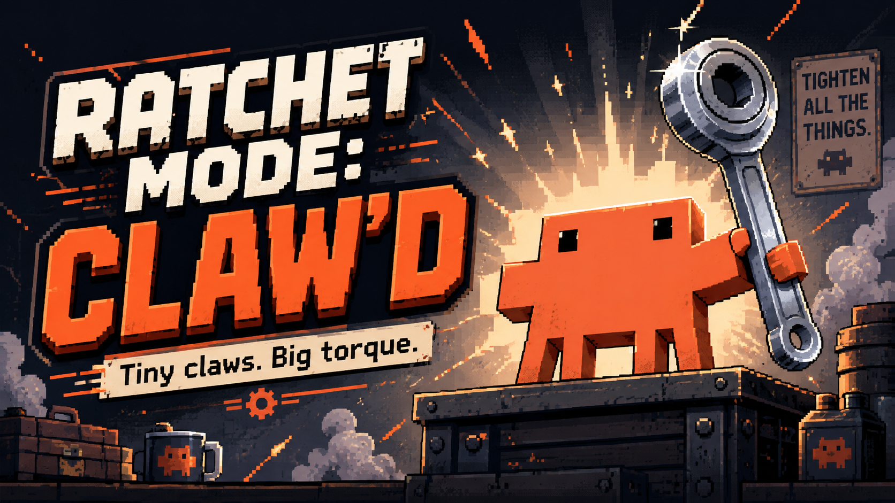

# Torque Loop

[](https://github.com/TheLucidTech/torque-loop/actions/workflows/ci.yml)
[](LICENSE)
[](package.json)

**Mutate. Test. Keep the delta.**

A Claude Code plugin for evolving one artifact through evidence-gated improvement loops.

> Not affiliated with, endorsed by, or sponsored by Anthropic.

Torque Loop is **not a prompt library.** A prompt library gives Claude better words. Torque
Loop gives Claude a job:

> **frame → choose → build → attack → patch → serialize → advance**

It bundles two things:

- **The Ratchet command family** (`/ratchet:*`) — a consequence engine that turns ambiguity
  into shipped, falsifiable artifacts through adversarial execution loops.
- **`/ratchet:evolve`** — a narrower, bounded loop that mutates one artifact, tests it, and
  keeps only proven improvement.

Every command produces *pressure*, not just insight. Each one forces a choice, creates an
artifact, tests an artifact, patches a defect, serializes state, kills an option, or pushes
to a higher-yield move. Everything else is smoke.

The whole system is a one-way progress mechanism — it only turns forward, and it remembers
where it stopped. Session state persists to disk, so the next session resumes instead of
restarting. *Ambiguity in. Artifact out. Failure tested. State advanced.*

---

## Install

Torque Loop has two halves: the **Claude Code plugin** (the slash commands + agents + hooks)
and the **`ratchet` CLI** (the state engine the commands call). Installing the plugin is the
main path; the CLI ships inside it and is put on `PATH` automatically while the plugin is
enabled. The plugin's command namespace stays `/ratchet:*` — the brand is Torque Loop, the
commands keep the wrench energy.

### Requirements

- [Claude Code](https://claude.com/claude-code)
- Node.js ≥ 18 (`node --version`)
- On Windows, the bundled hooks call the CLI via `node`, so no shell-specific setup is
  needed.

### A. Install as a Claude Code plugin — global (available in every project)

The repo doubles as a single-plugin marketplace, so you can install it directly.

```bash
# 1. get the repo
git clone https://github.com/TheLucidTech/torque-loop.git

# 2. in Claude Code, register it as a marketplace and install
/plugin marketplace add /absolute/path/to/torque-loop
/plugin install ratchet@torque-loop
```

Or point at the GitHub repo without cloning first:

```text
/plugin marketplace add TheLucidTech/torque-loop
/plugin install ratchet@torque-loop
```

Then reload when prompted. Verify with `/help` — you should see the `/ratchet:*` commands.
Manage or remove later from the interactive `/plugin` menu.

### B. Install for a single project only (local, checked into the repo)

Scope the plugin to one project so teammates get it automatically when they open that repo.
Add it to the project's `.claude/settings.json`:

```jsonc
// <your-project>/.claude/settings.json
{
  "plugins": {
    "marketplaces": {
      "torque-loop": { "source": "/absolute/path/to/torque-loop" }
    },
    "install": ["ratchet@torque-loop"]
  }
}
```

Or vendor it directly inside the project and reference the local path. Either way the
commands appear only when that project is open. (Prefer an absolute path, or a path relative
to the settings file, so it resolves on every machine.)

### C. Install the `ratchet` CLI on its own (optional)

The commands find the CLI automatically, but you can also use `ratchet` from any terminal.

```bash
cd torque-loop

# global — puts `ratchet` on your PATH everywhere
npm install -g .

# or local dev link — symlinks the CLI while you hack on it
npm link

# or no install at all — run it in place
node bin/ratchet --help
```

Verify:

```bash
ratchet --version      # -> ratchet 0.2.0
ratchet init
ratchet status
```

### State location

State survives plugin updates. It is written to, in order of preference:

1. `$CLAUDE_PLUGIN_DATA` — set by Claude Code for enabled plugins (recommended).
2. `$RATCHET_DATA_DIR` — override it yourself.
3. `~/.ratchet` — fallback.

State is scoped per project (by working-directory path), so multiple repos never collide in
one shared data directory.

---

## Commands

Run `/ratchet:ignite` when you don't know which command to run — it drives the full loop.

### Core loop

| Command | Purpose |
| --- | --- |
| `/ratchet:ignite` | Run the full consequence loop on any messy task. |
| `/ratchet:lock` | Convert vague input into a locked, executable target. |
| `/ratchet:auction` | Rank the real blockers by leverage; pick the one bottleneck. |
| `/ratchet:cut` | Attack the hidden assumptions before you invest. |
| `/ratchet:mechanism` | Name the one mechanism under a confusing situation. |
| `/ratchet:build` | Force artifact production — the smallest usable v0. |
| `/ratchet:attack` | Run the five-voice hostile board. |
| `/ratchet:verify` | Build a harness that could embarrass the artifact, then run it. |
| `/ratchet:patch` | Fix only what failed — minimal REMOVE / ADD / CHANGE delta. |
| `/ratchet:decide` | Force one defended choice with a reversal tripwire. |
| `/ratchet:burn` | Kill or park the options draining your energy. |
| `/ratchet:push` | Push the boundary once a safe version exists. |
| `/ratchet:compile` | Serialize the session into durable state. |
| `/ratchet:status` | Read the current ratchet state. |
| `/ratchet:loop` | Repeat build → attack → patch → compile until it holds. |

### Specialized

| Command | Purpose |
| --- | --- |
| `/ratchet:repo-audit` | Discover user-facing features/routes/APIs by code evidence. |
| `/ratchet:qa-ledger` | Create/update the canonical feature/test/defect ledger. |
| `/ratchet:prompt-audit` | Audit a prompt library as an operating system. |
| `/ratchet:handoff` | Produce a compact handoff for another agent or session. |

Every command maps to a canonical prompt. The source prompts live in
[`reference/PROMPTS.md`](reference/PROMPTS.md) — the load-bearing intent each skill
implements.

### Evolution

One narrower, standalone command — a bounded, evidence-gated mutation loop over a **single**
artifact (code file, prompt, skill, README, spec, workflow):

| Command | Purpose |
| --- | --- |
| `/ratchet:evolve` | Mutate → test → keep only proven improvement → serialize the next edge. |

```
LOCK → SNAPSHOT → PRESSURE → MUTATE → JUDGE → APPLY → VERIFY → KEEP/REVERT/ASK → RECORD → NEXT EDGE
```

```bash
/ratchet:evolve src/auth/session.js --goal "reduce login-state race conditions" --test "npm test -- auth" --mode code
/ratchet:evolve README.md --goal "make install impossible to misunderstand" --mode docs
```

It defaults to `--iterations 2` and **proposes** patches without `--write`. Its rule is
absolute: **no proof → no keep; no keep → no progress claim.** It is never a general "make
this better" — it evolves along one chosen pressure vector and records every verdict to
`.ratchet/evolve-log.jsonl` via the `ratchet-evolve` helper CLI.

> Note: because plugin skills are namespaced by the plugin, the command is invoked as
> `/ratchet:evolve` (renamed from the older `ratchet-evolve` skill in v0.2.0 — no alias is
> kept). Drop the `SKILL.md` into `~/.claude/skills/evolve/` to use it as a bare `/evolve`
> outside the plugin.

#### One run, end to end

```text
Before:    README install path is ambiguous — global vs. project vs. CLI-only blur together.

Command:   /ratchet:evolve README.md --goal "make install impossible to misunderstand" --mode docs

Mutation:  Split install into three labelled paths (global plugin, project-local, CLI-only),
           each with its own verify step. No other section touched.

Verify:    Manual docs checks — first-use path unambiguous, no contradiction, no missing step
           between install and first success. All passed.

Verdict:   KEEP        ← allowed only because evidence exists; the proof gate rejects a bare KEEP

Next edge: Add a 60-second GIF of the plugin install.  (readable later via `ratchet-evolve next`)
```

Every verdict lands in `.ratchet/evolve-log.jsonl`. A `KEEP` without verification evidence is
refused at write time — the loop cannot record progress it did not prove.

---

## How it works

```
skills/*/SKILL.md   →  Claude-facing operating discipline (the slash commands)
agents/*.md         →  ratchet-builder · ratchet-auditor · ratchet-scribe
hooks/hooks.json    →  session-start init · post-edit tracking · stop-compile reminder
bin/ratchet         →  the state CLI (added to PATH while the plugin is enabled)
bin/ratchet-evolve  →  the evolution-loop helper CLI (snapshot · score · verify · log)
src/*.js            →  state, scoring, ledger, artifact indexing, snapshots, rendering
src/evolve/*.js     →  snapshot · pressure · mutation scoring · verify runner · journal
templates/*         →  copy-paste shapes for decision / artifact / defect records
```

The skills carry the reasoning; the CLI carries the state. A skill loads context by calling
the CLI, does its work, and writes the result back:

```bash
ratchet status                     # what the ratchet knows right now
ratchet snapshot repo              # cheap ground-truth read of the codebase
ratchet score friction '[...]'     # rank obstacles: Leverage × Certainty × Time × Risk (1–10)
ratchet score confidence           # session confidence + whether the loop may stop
ratchet artifact add '{...}'       # record an artifact
ratchet defect add '{...}'         # record a defect (also lands in the QA ledger)
ratchet export markdown            # the full compile / handoff
```

Run `ratchet --help` for the complete surface.

### The agents

- **`ratchet-builder`** — produces the smallest usable artifact; refuses to deliberate.
- **`ratchet-auditor`** — attacks artifacts, assumptions, and self-serving reasoning.
- **`ratchet-scribe`** — serializes state, decisions, defects, and next moves.

### The hooks (conservative by design)

Ratchet creates pressure, not surprise. The hooks never run tests or edits on their own:

- **SessionStart** — ensure the data directory exists.
- **PostToolUse** (Write / Edit) — record touched files and mark state dirty.
- **Stop** — if work changed but nothing was compiled, remind you to run `/ratchet:compile`.

---

## Development

```bash
npm test        # zero-dependency smoke test over the state engine
npm run ratchet -- status
```

## Contributing

Contributions that keep the tool small, tested, and falsifiable are welcome. Start with
[`CONTRIBUTING.md`](CONTRIBUTING.md), and note the project's own rule applies to PRs too:
**no proof → no keep.** Please also read the [Code of Conduct](CODE_OF_CONDUCT.md).

Found a security issue? Report it privately — see [`SECURITY.md`](SECURITY.md), not the
public issue tracker.

## License

MIT © 2026 Danny Gillespie

Not affiliated with, endorsed by, or sponsored by Anthropic. "Claude" and "Claude Code" are
trademarks of Anthropic.

---

*Torque Loop — tiny claws, big torque.*
